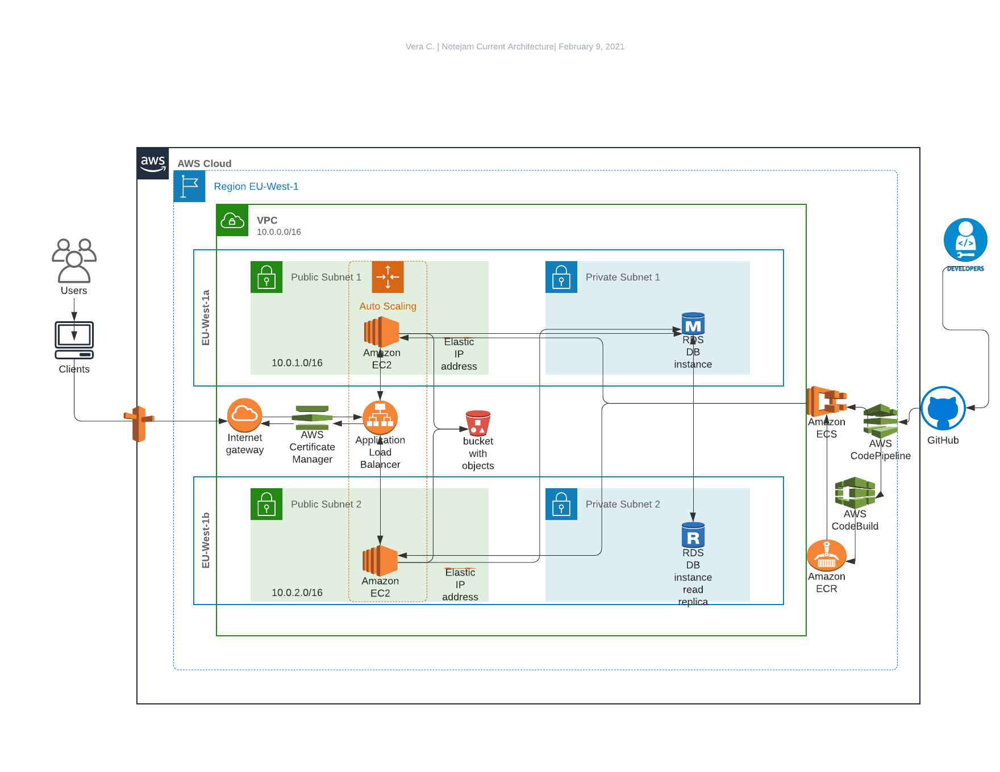
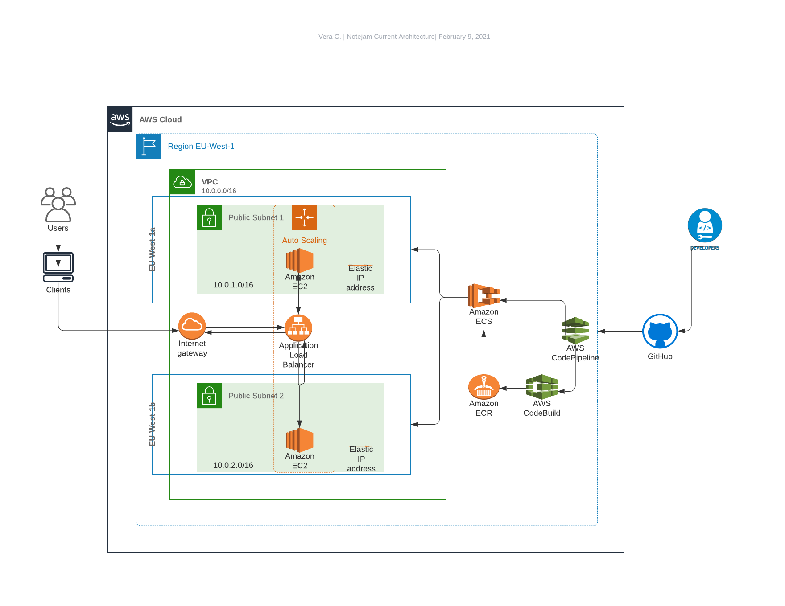

notejam-demo: Spring Cloud Deployment
==================================================

Requirements: 

- The Application must serve variable amount of traffic. Most users are active during business hours. During big events and conferences the traffic could be 4 times more than typical.
- The Customer takes guarantee to preserve your notes up to 3 years and recover it if needed.
- The Customer ensures continuity in service in case of datacenter failures.
- The Service must be capable of being migrated to any regions supported by the cloud provider in case of emergency.
- The Customer is planning to have more than 100 developers to work in this project who want to roll out multiple deployments a day without interruption / downtime.
- The Customer wants to provision separated environments to support their development process for development, testing, production in the near future.
- The Customer wants to see relevant metrics and logs from the infrastructure for quality assurance and security purposes.

About this solution
--------------------

For this assignment, deployment is carried out on AWS.

The app is dockerized and deployed through CI/CD pipeline to ECS cluster with ALB/Auto-scaling which programmatically assigns the tasks to back-ends. The same templace can be deployed into dev and test environment mirroring prod, and to other regions.

Logs and metrics are collected from relevant components of the infrastructure, in particular:
- CodeBuild - application and container build logs 
- ECS - container deployment logs, ECS metrics
- ALB - ALB metrics, ALB  access logs must be enabled

Future considerations:
- Decouple database and deploy to RDS
- Consider using read-replica for high availibility
- Decouple application storage and deploy to S3
- Apply S3 lifecycle policy to the applciation files to be archived to Glacier and kept up to 3 years
- Enable S3 access logging is insight into the traffic is desired
- Integrate pipeline with ECR scans of docker containers
- Fail pipeline if crotical/high severity issue found by ECR scan
- Integrate pipeline stages with manual approvals
- Deploy application to more regions and use Route 53 latency-based routing policy to deliver high availibility 
- Consier using AWS WAF with ALB for protection against common applciation-layer web attacks
- Consider usign ACM to secure ALB traffic with SSL certificates

Improved architecture:



Steps to deploy
------------------

These steps assume that you have AWS credentials with minimum required privileges to deploy the stack. The number of services deployed by this project requires very broad IAM permissions, I recommend using MFA-protected IAM use/role with such policy.

Launching this AWS CloudFormation stack provisions a continuous deployment process that uses AWS CodePipeline to monitor a GitHub repository for new commits and AWS CodeBuild to create a new Docker container image and to push it into Amazon Elastic Container Registry (Amazon ECR).

When creating this stack, you can opt to deploy the service onto AWS Fargate or Amazon EC2. AWS Fargate allows you to run containers without managing clusters or services. If you choose Amazon EC2, an Auto Scaling group of t2.micro instances will be created to host your service.

Current architecture:



#### 1. Fork the GitHub repository

[Fork](https://help.github.com/articles/fork-a-repo/) the [notejam-demo](https://github.com/afrovera/notejam-demo) GitHub repository into your GitHub account.

From your terminal application, execute the following command (make sure to
replace `<your_github_username>` with your actual GitHub username):

```console
git clone https://github.com/<your_github_username>/notejam-demo
```

This creates a directory named `notejam-demo` in your current directory, which contains the code for the Amazon ECS sample app.

#### 2. Create the CloudFormation stack

Copy the [templates](https://github.com/afrovera/devsecops/tree/master/templates) folder to your own S3 bucket. Note, this should result in a folder your_bucket/templates with 6 CloudFormation tempaltes. Copy direct link to ecs-continuous-deployment.yaml template from your bucket. If deploying in multiple regions, create bucket in each region with matching /templates folder. Repeat deployment steps below for each region. 

In CloudFormation console (or via CLI) deploy ecs-continuous-deployment.yaml template by pasting the link in 'specify an Amazon S3 template URL' field. 

The CloudFormation template requires the following parameters:

Cluster Configuration

Launch Type: Deploy the service using either AWS Fargate or Amazon EC2. Selecting EC2 will create an Auto Scaling group of t2.micro instances for your cluster. This notejam-demo solution was tested with Amazon EC2. See the documentation to learn more about launch types.

GitHub Configuration

Repo: The repo name of the notejam-demo.
Branch: The branch of the repo to deploy continuously.
User: Your username on GitHub.
Personal Access Token: Token for the user specified above. (https://github.com/settings/tokens)

The CloudFormation stack provides the following output:

ServiceUrl: The sample service that is being continuously deployed.

PipelineUrl: The continuous deployment pipeline in the AWS Management Console.

What Should I Do Before Running My Project in Production?
---------------------------------------------------------

You should regularly apply patches and review security best practices for the dependencies used by your application. Use these security best practices to update your sample code and maintain your project in a production environment:

1. Before you deploy your project, follow the best practices developed for your framework.
2. Deploy to test environment first, run the tests there and remediate issues.
3. Have all necessary backups ready to go for production should anything go wrong. 
4. Follow the recommendations from well architected framework and build for failure. 
5. Continuously monitor the environment for any anomalies with the SIEM tools.
6. Fix security bugs within the acceptable timeframe for each type of severity.
7. Employ cloud governance model and keep track of your inventory.
